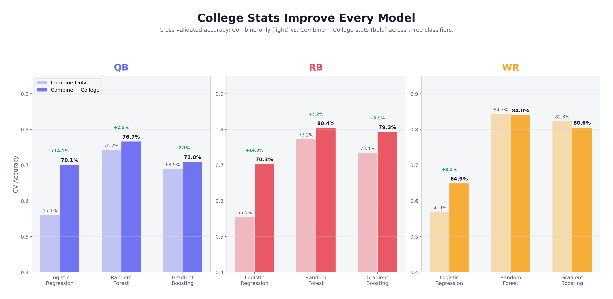
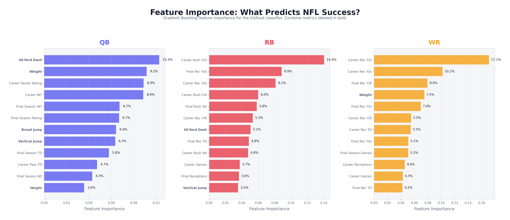
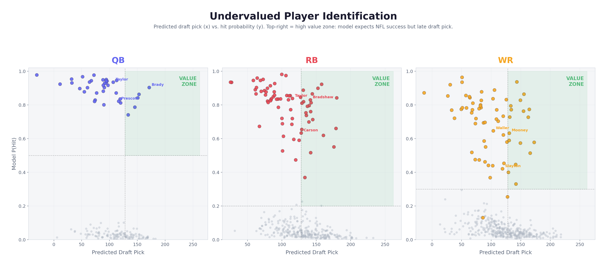

# Finding Undervalued NFL Draft Prospects

**TAMIDS 2026 Sports Data Science Competition — winner of the visualization round, against 8 competing teams**

Every NFL team has the same combine measurables and the same college box scores. If
that information alone told you who would succeed, there would be no such thing as a
seventh-round Hall of Famer. This project asks a narrower, more useful question:

> **Where does the draft market systematically misprice players — and can we identify
> those players from public pre-draft data alone?**

The approach is to build two models per position and read the *gap between them*:

| | Question it answers |
|---|---|
| **Hit/bust classifier** | How good is this player likely to actually be? |
| **Draft-pick regressor** | How good do NFL teams think he is? |

A player the success model likes but the draft model expects to fall is, by
construction, a player the market is undervaluing. Run over 25 years of drafts, that
gap surfaces Tom Brady, Aaron Jones, and Darren Waller.

---

## Key results

**Adding college production to combine measurables improved cross-validated accuracy
for every model at QB and RB** — the single clearest finding in the project. Combine
drills alone are close to useless in isolation; their correlations with career value
are near zero across all six drills.



5-fold cross-validated accuracy, combine-only → combine + college:

| Position | Logistic Regression | Random Forest | Gradient Boosting |
|---|---|---|---|
| QB | 0.561 → **0.701** | 0.742 → **0.767** | 0.689 → **0.718** |
| RB | 0.555 → **0.703** | 0.776 → **0.801** | 0.734 → **0.793** |
| WR | 0.569 → **0.649** | 0.843 → 0.840 | 0.823 → 0.806 |

WR is the honest exception: the tree models did not improve there, and we report that
rather than hiding it.

> *One discrepancy worth naming: the QB Gradient Boosting bar in the figure above reads
> 71.0%, while the notebook's cross-validated output for that model is 0.718. The other
> seventeen bars match the notebooks exactly. The figure was exported during the
> competition from a run whose code we no longer have (see [Notes and limitations](#notes-and-limitations));
> the table above reports the notebook values, which are the ones to trust.*

### Accuracy is the wrong metric here

Because roughly 75–85% of drafted players are busts by our thresholds, a model that
predicts "bust" every time scores ~84% accuracy at WR and identifies **zero** useful
players. Hit *recall* and *precision* are what matter, so we tuned the decision
threshold per position rather than accepting the default 0.50:

| Position | Threshold | Hit precision | Hit recall |
|---|---|---|---|
| QB | 0.50 | 0.67 | 0.22 |
| RB | 0.20 | 0.44 | 0.39 |
| WR | 0.30 | 0.38 | 0.35 |

Lowering the RB threshold from 0.50 to 0.20 more than doubled hit recall (0.17 → 0.39)
while precision held near 0.44 — a worthwhile trade when the output is a shortlist a
scouting staff will evaluate further, not a final decision.

### Draft position is only partly explainable

Best draft-pick regressor per position, 5-fold CV mean absolute error in picks:

| Position | Best model | CV MAE | Test MAE | Test RMSE | Test R² |
|---|---|---|---|---|---|
| QB | Lasso | 61.6 ± 6.8 | 60.8 | 75.2 | 0.045 |
| RB | Lasso | 49.2 ± 5.7 | 48.8 | 57.6 | 0.228 |
| WR | Ridge | 51.7 ± 6.3 | 51.5 | 63.5 | 0.228 |

The QB R² of 0.045 is a result, not a failure. Measurables and college production
explain almost none of the variance in where a quarterback is drafted — arm talent,
film study, and interviews drive that market, and they are not in this dataset. At RB
and WR, where teams lean more heavily on production and testing, the same features
explain roughly 23% of the variance.

### What actually predicts success



College production dominates at the skill positions — career receiving yards per game
is the top WR feature at 17.1% importance, career rushing yards per game leads at RB
at 14.0%. QB is the outlier: the 40-yard dash (10.3%) and weight (9.2%) rank above
career passer rating (8.9%), which says more about how little signal any single QB
feature carries than about 40 times mattering for quarterbacks.

### The value zone



Players in the top-right — high modeled hit probability, late predicted draft slot —
are the targets.

> **These are in-sample results — read them as a demonstration, not a validation.**
> Both models below are refit on the full dataset and then scored on that same data, so
> each player's own career outcome influenced the model that ranks him. What the table
> shows is that the value-gap framing surfaces the right *kind* of player. It is not
> evidence of out-of-sample skill, and it would be wrong to quote these as model
> performance. The cross-validated numbers above are the honest measure: hit recall of
> 0.22–0.39, and draft-pick CV MAE between roughly 49 and 62 picks.

Top three per position by value score (hit probability × 100 + pick difference):

| Position | Player | Actual pick | Predicted pick | P(hit) | Career wAV |
|---|---|---|---|---|---|
| QB | Tyrod Taylor | 180 | 106.6 | 0.935 | 50 |
| QB | **Tom Brady** | 199 | 171.2 | 0.903 | 184 |
| QB | Dak Prescott | 135 | 116.4 | 0.822 | 104 |
| RB | Ahmad Bradshaw | 250 | 141.3 | 0.830 | 42 |
| RB | **Aaron Jones** | 182 | 89.4 | 0.927 | 67 |
| RB | Chris Carson | 249 | 127.9 | 0.634 | 29 |
| WR | **Darren Waller** | 204 | 103.5 | 0.647 | 33 |
| WR | D.K. Metcalf | 64 | 26.6 | 0.853 | 57 |
| WR | Justin McCareins | 124 | 67.1 | 0.519 | 33 |

---

## Data

| Source | What it provides | Access |
|---|---|---|
| [`nfl_data_py`](https://github.com/nflverse/nfl_data_py) → [nflverse](https://github.com/nflverse/nflverse-data) | Combine measurables (2000–2026) and draft picks with career outcomes (1980–2025) | `pip install nfl_data_py`, pulled live in notebook 01 |
| [Sports Reference — College Football](https://www.sports-reference.com/cfb/) | Season and career college passing / rushing / receiving stats | **Not redistributed here** — see below |

**Career success is measured by weighted Approximate Value (`w_av`)**, a Pro Football
Reference metric that weights peak seasons more heavily than career length, which makes
it comparable across positions.

### Usage restrictions

The college statistics are **not committed to this repository.** Sports Reference's
[terms of use](https://www.sports-reference.com/termsofuse.html) restrict bulk scraping
and redistribution of their data, so the raw per-season files are gitignored and only
the derived, merged dataset is included. To rebuild the college stats from scratch:

```bash
python src/scrape_college_stats.py    # ~4 hours; rate-limited to 1 request / 3s
```

The scraper is deliberately polite (3-second delay, resumable, saves every 50 players).
Please respect Sports Reference's terms if you run it. `nfl_data_py` and nflverse data
are openly licensed and carry no such restriction.

---

## Data cleaning

1. **Merge combine to draft records** on `pfr_id` + `season` with an inner join. The
   Pro Football Reference ID uniquely identifies a player across both sources; `season`
   is included as a second key to handle players appearing in multiple combine years
   (injury, returning to school). About 1,500 rows per source with missing PFR IDs were
   dropped before the join.
2. **Drop duplicated columns** the merge created — `draft_ovr`/`pick`, `draft_year`/`season`,
   `pos`/`position` and similar pairs carried identical information.
3. **Map 21 raw positions into 10 position groups** (QB, RB, WR, TE, OL, DL, EDGE, LB,
   CB, S). 84 rows whose position matched nothing were dropped.
4. **Convert height** from `6-5` strings to inches.
5. **Attach conference and conference tier** (Power 4 / Group of 5 / Other) via a
   school-to-conference lookup, then one-hot encode. A one-way ANOVA confirmed
   conference relates to career value (F = 2.48, p = 0.0031).
6. **Merge college stats** on `cfb_id`, taking each player's career totals and final
   college season. Players without a match were dropped.

The result is **`data/processed/merged_data_with_college.csv` — 5,302 players, 91
columns**, spanning the 2000–2025 drafts. Hit/bust labels are deliberately *not* stored
in it; each model notebook derives its own from `w_av`, so there is a single source of
truth for the labels.

---

## Methodology

**Position-specific models throughout.** wAV distributions differ enough by position
that a single pooled model would blur exactly the comparison that matters — a fourth-round
receiver playing like a second-round receiver.

**Hit/bust labels** use a fixed wAV threshold per position, chosen by inspecting which
real players fell above each cutoff rather than by taking a percentile mechanically:

| Position | wAV threshold | Hits | Busts |
|---|---|---|---|
| QB | ≥ 40 | 59 | 212 |
| RB | ≥ 28 | 100 | 400 |
| WR | ≥ 32 | 121 | 583 |

**Features.** Five combine measurables (height, weight, 40-yard dash, vertical, broad
jump) plus position-appropriate college production — career and final-season passing
for QB, rushing and receiving for RB, receiving for WR. Bench, cone, and shuttle were
excluded: 36–40% of players skip those drills, and keeping them would have cost roughly
half the sample.

**Models compared.** Logistic Regression, Random Forest, and Gradient Boosting for
hit/bust; Ridge, Lasso, Random Forest, and Gradient Boosting for draft pick. Features
standardized, 75/25 train/test split stratified on the label, `random_state=42`
throughout, 5-fold cross-validation for model selection.

**Value score** = `P(hit) × 100 + (actual pick − predicted pick)`, filtered to players
above the position's tuned probability threshold who were drafted later than predicted.

---

## Reproducing

```bash
git clone <this-repo>
cd TAMIDS_2026
python3 -m venv venv
source venv/bin/activate
pip install -r requirements.txt
jupyter lab
```

Run the notebooks in order:

| Notebook | What it does | Needs network |
|---|---|---|
| `01_eda_and_data_prep.ipynb` | Pulls combine + draft data, cleans, merges, explores | Yes |
| `02_qb_model.ipynb` | QB hit/bust + draft models | No |
| `03_rb_model.ipynb` | RB hit/bust + draft models | No |
| `04_wr_model.ipynb` | WR hit/bust + draft models | No |

**The three model notebooks reproduce exactly.** Re-executing them against the committed
`merged_data_with_college.csv` yields numeric output identical to the committed results,
verified with `jupyter nbconvert --execute`.

**Notebook 01 will not.** It pulls live from nflverse, where career values accumulate and
new draft classes land, so the combine/draft data it writes drifts from the snapshot the
analysis was run on. The committed CSVs are that snapshot; treat notebook 01 as the record
of how they were built, not as a step to re-run before the models.

---

## Repository structure

```
notebooks/
  01_eda_and_data_prep.ipynb    Data pull, cleaning, merging, exploratory analysis
  02_qb_model.ipynb             QB hit/bust classifier + draft-pick regressor
  03_rb_model.ipynb             RB models
  04_wr_model.ipynb             WR models
src/
  scrape_college_stats.py       Sports Reference CFB scraper (resumable, rate-limited)
data/
  processed/
    nfl_draft_combine.csv       Combine + draft merge with career outcomes
    merged_data.csv             Intermediate merge, input to the scraper
    merged_data_with_college.csv  Final modeling dataset (5,302 players, 91 columns)
  raw/
    school-conferences.txt      School → conference lookup
    college_stats/              Scraped college stats (gitignored — see Data)
figures/
  viz1_model_comparison.png     CV accuracy, combine-only vs + college
  viz2_hit_prob_vs_pick.png     Hit probability against actual draft pick
  viz3_undervalued_quadrant.png Value zone scatter
  viz4_actual_vs_predicted.png  Predicted vs actual draft position
  viz5_position_comparison.png  Cross-position comparison
  viz6_feature_importance.png   Gradient Boosting feature importance
  midpoint/                     Midpoint-presentation panels
reports/
  TAMIDS_2026.pdf               Competition report
  nfl_draft_report.tex          LaTeX source
  421_final_paper/              STAT 421 final paper (PDF + LaTeX)
```

---

## Team

Built for the TAMIDS 2026 Sports Data Science Competition (February–April 2026).

| | |
|---|---|
| **Tyler Nordberg** — *team lead* | Data cleaning and modeling |
| [Alex Dessler](https://github.com/alexdes101) | |
| [Nick Standley](https://github.com/nickstandley) | |
| [Josh Lee](https://github.com/bobdaehyun) | |
| Collin Weinmann | |

---

## Notes and limitations

- **Figure code is not in the repository.** The six visualizations in `figures/` were
  produced during the competition by a notebook that was not committed. They are shipped
  as exported PNGs; the underlying metrics are all reproducible from notebooks 02–04.
  One consequence is the single stale value in `viz1` noted above (QB Gradient Boosting
  shown as 71.0% against the notebook's 0.718) — without the plotting code it cannot be
  corrected at the source, so it is flagged rather than quietly edited.
- **Labels are derived, not stored.** `merged_data_with_college.csv` intentionally ships
  without a hit/bust column. Each model notebook derives its own labels from `w_av` using
  its position's threshold, so the dataset cannot drift out of sync with the models.
- **Survivorship in the labels.** Players drafted after 2020 have had less time to
  accumulate wAV, which biases them toward "bust." Notebook 01 identifies the dropoff;
  the position models do not apply a season cutoff.
- **Hit recall is low in absolute terms** (0.22–0.39). Predicting NFL success from
  pre-draft data is genuinely hard, and these models are a screening tool for narrowing
  a board, not a substitute for scouting.
